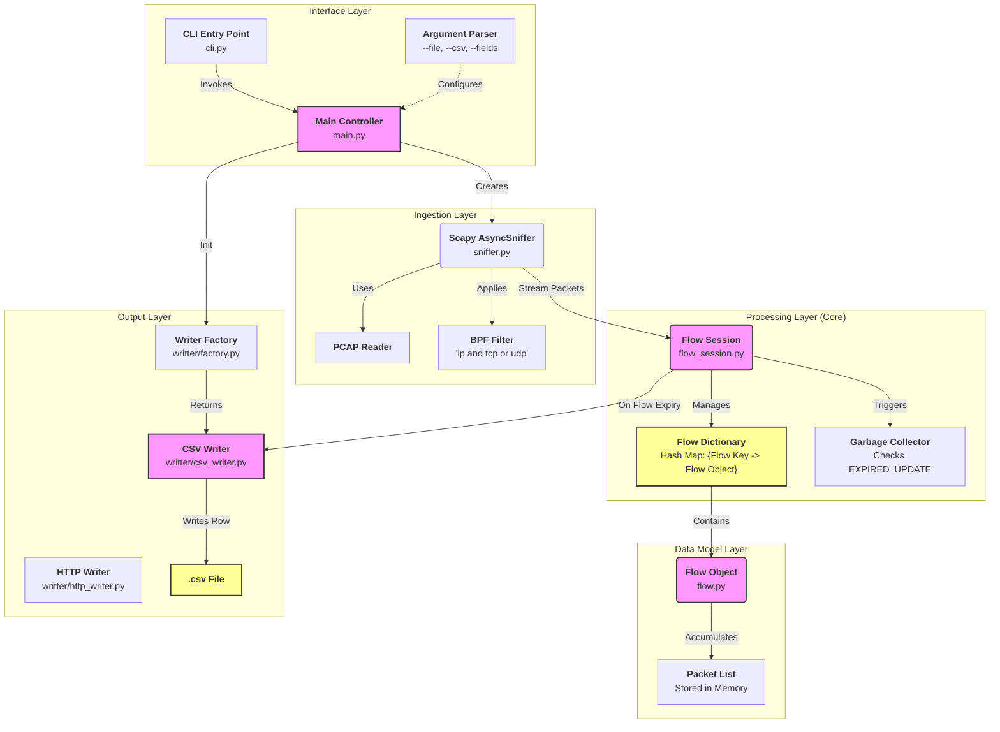
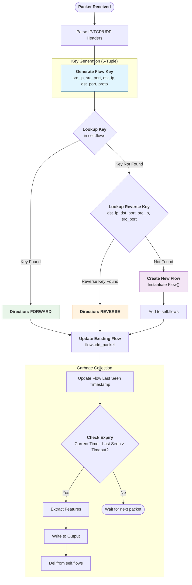
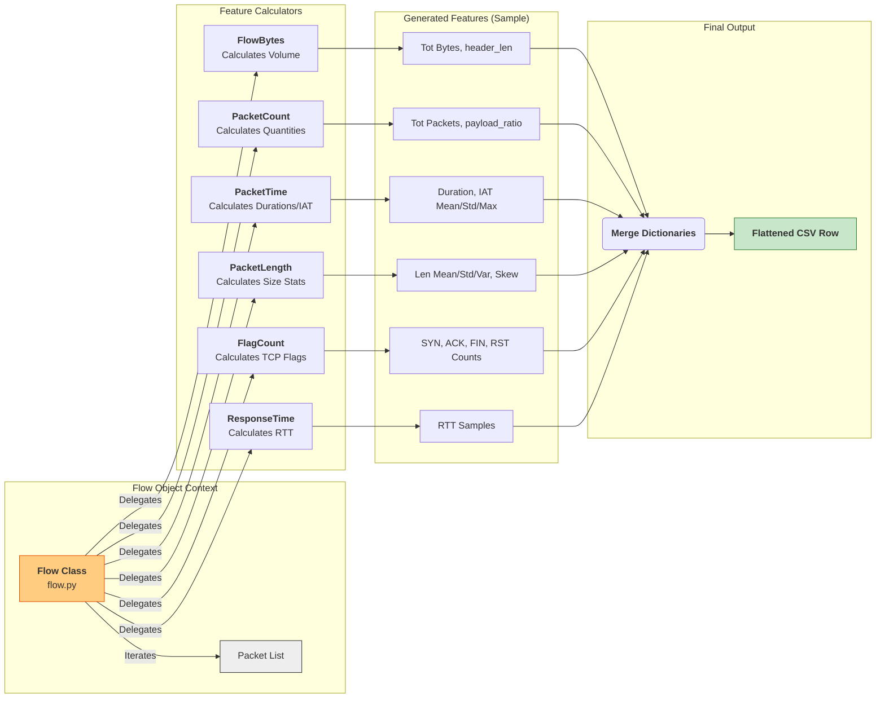

# PCAP-Feature-Extractor

## Installation

For a quick setup, first follow the [installation instruction of the uv Python package manager](https://docs.astral.sh/uv/getting-started/installation/).

```sh
git clone https://github.com/adrianstanea/PCAP-Feature-Extractor.git
cd PCAP-Feature-Extractor
uv sync
source ./.venv/bin/activate
```

As an alternative, you can also install the package directly in you Python environment:
```sh
pip install git+https://github.com/adrianstanea/PCAP-Feature-Extractor.git
```


## Usage
```sh
$ pcap_features --help

usage: pcap_features [-h] -f INPUT_FILE -c [--fields FIELDS] [-v] output

positional arguments:
  output                output file name (in CSV mode)

options:
  -h, --help            show this help message and exit
  -f INPUT_FILE, --file INPUT_FILE
                        capture offline data from INPUT_FILE
  -c, --csv             output flows as csv
  --fields FIELDS       comma separated fields to include in output (default: all)
  -v, --verbose         more verbose
```

How to convert `.pcap` file to `.csv` feature file:

```sh
pcap_features --file <path_to_pcap_file> --csv <path_to_save_csv_file>
```

## References

- https://github.com/ahlashkari/CICFlowMeter

## System Architecture & High-Level Design




## Flow Reconstruction Methodology




## Feature Extraction Process

